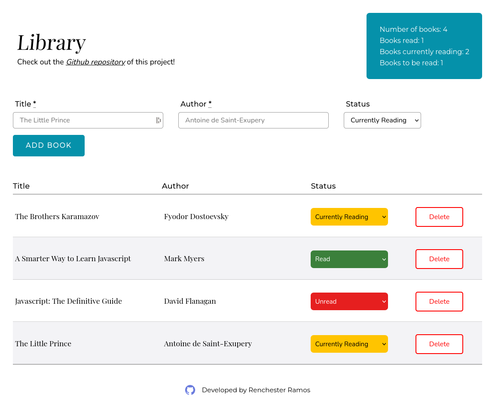

## The Odin Project

# Project: Library

[**Live version** of the webapp can be found here](https://renchester.github.io/top-library/)

This library app allows users to create a list of books that they are either reading, has read, or yet to be read. Built with HTML, CSS, and vanilla Javascript--using Firebase as a backend to store user input.

### Features

Users are provided with a form that asks for the book's title and author, as well as the book's 'read' status. This information is set in an array `myLibrary` to be uploaded to either the browser's local storage or to the cloud with Firebase's [Firestore Database](https://firebase.google.com/products/firestore). A log of the library contents is also provided for an overview of the user's reading habits.

### Technologies Used

- HTML
- CSS
- Vanilla Javascript
- Firebase

### Display

The books input by the user is displayed in a table with the book's title and author. The status of the book may be changed through a selection which will change the book's _status_ property in the `myLibrary` array. Next to the selection is a _delete_ button which allows the user to delete the book from the library.

---

Developed by **Renchester Ramos**
